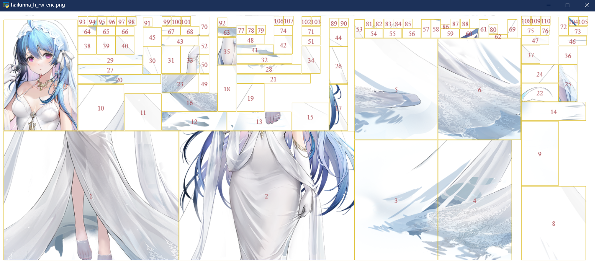
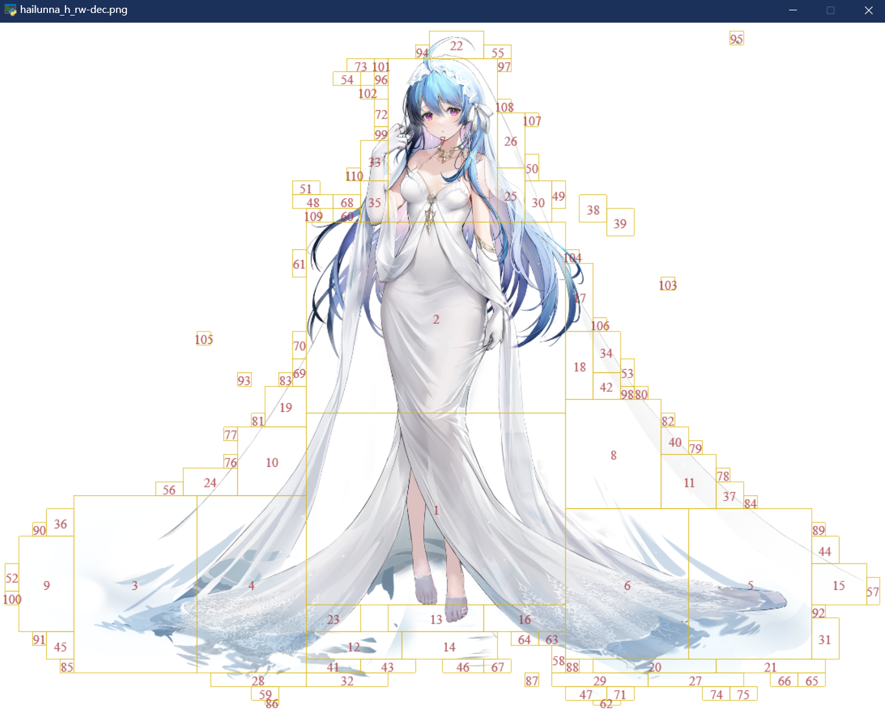

### 碧蓝航线立绘助手 AzurLaneTachieHelper

#### Features

- Easy drag & drop
- Decode & encode texture
- Merge & split paintingface 
- View bounding box comparision
- Support tachie with multiple layers
- Combine layers as photoshop document (psd)

#### Components (exemplified by `hailunna_h_rw`)

- `decoder.py`: extract and decode texture, combine to psd file
- `encoder.py`: encode and replace texture
- `merger.py`: reposition paintingface on painting, combine to psd file
- `splitter.py`: clip off non-paintingface part from whole painting
- `viewer.py`
  - ```
    usage: viewer.py [-h] [--win_width_enc W] [--win_width_dec W] [-p P] [--label_size S] [--label_color C C C C] [--bbox_color C C C C] [-l] chara

    Azur Lane Tachie Viewer

    positional arguments:
      chara                 tachie to view, eg. hailunna_h_rw

    options:
      -h, --help            show this help message and exit
      --win_width_enc W     display width of encoded image
      --win_width_dec W     display width of decoded image
      -p P, --padding P     padding for image in window
      --label_size S        size of labels in bouding box
      --label_color C C C C
                            RGBA color of labels in bouding box
      --bbox_color C C C C  RGBA color of bouding box
    ```
  - Run in default mode when drag and drop
  - Advanced options are limited to command line
  - Typical usage: `python viewer.py hailunna_h_rw --label_color 255 0 0 196`
  - 
  - 

#### File Organization (exemplified by `xinnong_2`)

- Before:
  ```
  main folder/
  |--painting/
  |  |--xinnong_2_front_tex
  |  L--xinnong_2_tex
  |--paintingface/
  |  L--xinnong_2
  L--xinnong_2
  ```
- After:
  ```
  main folder/
  |--output/
  |  |--painting/
  |  |  |--xinnong_2_front_tex
  |  |  L--xinnong_2_tex
  |  L--paintingface/
  |     L--xinnong_2
  |--painting/
  |  |--xinnong_2_front_tex
  |  L--xinnong_2_tex
  L--paintingface/
  |  |--diff/
  |  |  |--1.png
  |  |  |--2.png
  |  |  |--3.png
  |  |  |--4.png
  |  |  |--5.png
  |  |  L--6.png
  |  L--xinnong_2
  |--xinnong_2
  |--xinnong_2_front-mesh.obj
  |--xinnong_2_mesh.obj
  |--xinnong_2_front-dec.png
  |--xinnong_2_front-enc.png
  |--xinnong_2-dec.png
  |--xinnong_2-enc.png
  L--xinnong_2.psd
  ```

#### Requirements

- Python 3.11+ with following libraries:
  - pyglet 2.0.5+
  - numpy
  - pillow
  - pytoshop
  - unitypy
  - (Optional) pyinstaller
- Or just run:
  - ```shell
    pip install -r requirements.txt
    ```